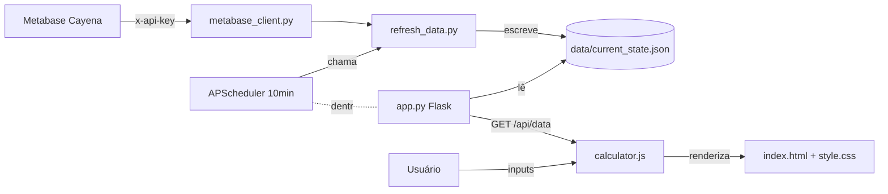

# Contexto Completo — Calculadora de Aprovação de Desconto (Cayena)

Este documento é o handoff técnico do projeto. Outro agente de IA (Cursor, Claude, etc.) ou dev humano deve conseguir entender 100% do funcionamento lendo apenas este arquivo + os arquivos referenciados aqui.

---

## 1. O que é

Aplicação web Flask que ajuda o time comercial da **Cayena** a simular o impacto de um pedido com desconto sobre as métricas de **descontos diários/mensais** e **GMV (Gross Merchandise Value)**, comparando o resultado simulado com o limite interno de **3,5% de desconto sobre GMV**.

Os dados de referência (descontos e trends de GMV) são puxados automaticamente de **5 cards do Metabase** a cada 10 minutos.

Existe em dois modos:
1. **Web (Render)** — deploy contínuo via `render.yaml`, servido por Gunicorn.
2. **Executável Windows (.exe)** — gerado via PyInstaller (`build.bat` + `calculadora.spec`) para distribuição offline a colaboradores.

---

## 2. Arquitetura



**Stack:**
- Backend: Python 3.11, Flask 3, APScheduler, requests, python-dotenv, gunicorn
- Frontend: HTML + CSS puro + JavaScript vanilla (sem framework)
- Empacotamento Windows: PyInstaller
- Deploy web: Render (gunicorn `wsgi:app`)

---

## 3. Estrutura de arquivos

```
.
├── app.py                  # Flask app + APScheduler + rotas
├── wsgi.py                 # Entry point gunicorn (Render)
├── launcher.py             # Entry point .exe (abre browser local)
├── refresh_data.py         # ETL: Metabase -> current_state.json
├── metabase_client.py      # Cliente REST do Metabase
├── paths.py                # Path resolution dev vs PyInstaller
├── requirements.txt        # Deps Python
├── calculadora.spec        # Config PyInstaller
├── build.bat               # Build .exe (Windows)
├── instalar.bat            # Instalação completa (Windows)
├── render.yaml             # Config Render
├── BUILD.md                # Doc do build .exe
├── .env.example            # Template de variáveis
├── data/
│   ├── current_state.json  # Cache de dados do Metabase (gerado)
│   └── .gitkeep
├── templates/
│   ├── index.html          # UI principal
│   └── login.html          # Tela de senha
└── static/
    ├── css/style.css       # Estilos
    └── js/calculator.js    # Lógica do frontend
```

---

## 4. Variáveis de ambiente (.env)

Copie `.env.example` para `.env` e preencha:

```
METABASE_URL=https://cayena.metabaseapp.com
METABASE_API_KEY=<chave_do_metabase>
REFRESH_INTERVAL_MINUTES=10
APP_PASSWORD=<senha_para_login>
SECRET_KEY=<string_aleatoria>
HOST=127.0.0.1               # 0.0.0.0 em produção
```

No Render essas vars são configuradas via dashboard (vide `render.yaml`).
No `.exe`, o `.env` é embutido pelo PyInstaller (datas em `calculadora.spec`).

---

## 5. Backend — fluxo de dados

### 5.1. `paths.py`
Centraliza resolução de caminhos. Importante porque o app roda em **3 contextos**:
- Dev local (Python direto)
- Bundle PyInstaller (`sys._MEIPASS` é temp + executável tem cwd próprio)
- Render (cwd normal)

Funções:
- `bundle_path()` — recursos read-only (templates, static, .env)
- `app_path()` — diretório onde o `.exe` mora (writable)
- `data_dir()` / `data_file()` — `data/current_state.json` writable
- `env_file()` — `.env` (sempre dentro do bundle)

### 5.2. `metabase_client.py`
Cliente REST simples. Autentica via header `x-api-key` (não usa session/cookie).

**5 cards consumidos** (IDs hardcoded em `CARD_IDS`):

| Nome interno | ID Metabase | Conteúdo |
|---|---|---|
| `daily_discounts` | 50332 | % de desconto por categoria, **por dia** (mês corrente) |
| `pct_desconto_historico` | 50334 | % de desconto por categoria, **por mês** (histórico) |
| `trend_diario` | 50336 | GMV realizado hoje + meta dia + trend de fechamento |
| `trend_mensal_semanal` | 50335 | GMV MTD, meta mês/semana, trend mensal |
| `intraday` | 50333 | GMV hora a hora hoje vs média histórica |

Método principal: `query_card(card_id)` faz `POST /api/card/{id}/query` e devolve `List[dict]` (linhas com colunas como chaves).

### 5.3. `refresh_data.py` — ETL crítico

**Por que existe:** os cards `daily_discounts` e `pct_desconto_historico` retornam **percentuais** (`%total`, `%tag_verde`, etc.), mas o frontend espera **valores absolutos** em R$. Esse arquivo reconstrói os absolutos multiplicando os % pelo GMV vindo dos cards de trend.

**Mapeamento percentual → coluna absoluta** (`PCT_FIELD_MAP`):

```python
"%total" -> "vlr_total"
"%tag_verde" -> "vlr_tag_verde"
"%abre_portas" -> "vlr_abre_portas"
"%exclusivo" -> "vlr_exclusivo"
"%comercial sups" -> "vlr_comercial_sups"
"%adf" -> "vlr_adf"
"%ops_realocados" -> "vlr_ops_realocados"
"%ops_outros" -> "vlr_ops_outros"
"%cupom app" -> "vlr_cupom_app"
"%cupom prover" -> "vlr_cupom_prover"
"%cupom pap" -> "vlr_cupom_pap"
"%cupom ops" -> "vlr_cupom_ops"
"%hcd" -> "vlr_hcd"
"% comercial vendedores" -> "vlr_comercial_vendedores"
"% comissao" -> "pct_comissao"
```

**Função `build_daily_discounts()`** — gera 2 linhas em `daily_discounts[]`:

1. **"Resto do mês"** (data = primeiro dia do mês corrente):  
   `gmv_fp = mtd_gmv - today_gmv`  
   Cada categoria: `mês_total - hoje` (clamp ≥ 0).  
   Existe para que `aggregateMonth()` no frontend funcione somando todas as linhas e dê o total mensal correto.

2. **"Hoje"** (data = hoje):  
   `gmv_fp = today_gmv`  
   Cada categoria: `gmv * pct_da_categoria` (do card `daily_discounts`).

**Função `transform_gmv_trend()`** — combina os 3 cards de trend num único objeto `gmv_trend` com todas as métricas que o frontend usa: `meta_mensal`, `realizado_mtd`, `realizado_hoje`, `atingimento_mensal`, `trend_mensal`, `meta_prover_dia`, `trend_fechamento_dia`, `percentual_dia_decorrido`, `intraday[]`, etc.

Resultado salvo em `data/current_state.json`. Estrutura:
```json
{
  "updated_at": "2026-04-15T11:22:02-03:00",
  "daily_discounts": [ {row_resto_mes}, {row_hoje} ],
  "gmv_trend": { meta_mensal, realizado_mtd, ..., intraday: [...] }
}
```

**Timezone:** todo o backend usa `BRT = timezone(timedelta(hours=-3))` (não usa UTC, não usa pytz). Isso foi corrigido em commits recentes (`c68b553`, `41724b2`).

### 5.4. `app.py` — Flask + scheduler

**Rotas:**
- `GET /` — render `index.html` (requer auth se `APP_PASSWORD` setada)
- `GET /login` / `POST /login` — login por senha simples (compara com `APP_PASSWORD`, salva `session["authenticated"]`)
- `GET /logout`
- `GET /api/data` — retorna `current_state.json`
- `POST /api/refresh` — força refresh imediato do Metabase
- `GET /api/status` — retorna `{last_refresh, refresh_interval_minutes, scheduler_running}`

**Scheduler (`APScheduler BackgroundScheduler`):**
- Job `metabase_refresh` rodando a cada `REFRESH_INTERVAL_MINUTES` (default 10)
- Função `ensure_scheduler()` é idempotente — chamada por `wsgi.py` (Render) e por `launcher.py` (.exe)
- `scheduled_refresh()` chama `refresh_from_metabase()` e atualiza `_last_refresh_status` (memória)
- **Refresh inicial** roda uma vez no startup, antes do scheduler periódico

### 5.5. `wsgi.py` — produção
3 linhas: importa `app` e `ensure_scheduler`, chama o scheduler. Gunicorn (no Render) sobe via `gunicorn wsgi:app`.

### 5.6. `launcher.py` — .exe
Inicia Flask em `127.0.0.1:5050`, abre o browser default no URL após 1.5s de delay (via thread separada).

---

## 6. Frontend — lógica de cálculo

Todo o frontend é **uma única IIFE** em [static/js/calculator.js](static/js/calculator.js). Carrega dados via `fetch("/api/data")` e re-renderiza tudo a cada input do usuário.

### 6.1. Inputs (formulário)

Layout em `templates/index.html` dentro de `.input-grid` (grid 4 colunas):

| Campo | ID | Obrigatório | Editável | Função |
|---|---|---|---|---|
| Subproduto | `subproduto` | não | sim | descritivo, não entra em cálculo |
| Preço NF (R$ unit.) | `precoNF` | **sim** | sim | preço cheio unitário |
| Quantidade | `quantidade` | **sim** | sim | unidades do pedido |
| Preço Boleto (R$ unit.) | `precoBoleto` | um dos 3 | sim | preço com desconto |
| % Desconto (sobre NF) | `pctDesconto` | um dos 3 | sim | desconto percentual sobre NF |
| Valor Desconto (R$) | `vlrDesconto` | um dos 3 | sim | desconto total em reais |
| GMV calculado | `gmvDerivado` | — | **read-only** | `Qtd × Boleto` |
| Badge status | `discountType` | — | — | "Dentro do limite" / "Acima 3,5%" / "Preencha..." |

### 6.2. Auto-preenchimento tri-direcional

Com NF e Qtd preenchidos, o usuário digita **um** entre `precoBoleto`, `pctDesconto` (sobre NF) ou `vlrDesconto`. Os outros dois são calculados automaticamente. A flag `_lastEdited` (`"boleto" | "pct" | "vlr"`) é setada nos listeners `input` e indica qual é o pivô. As flags `_boletoFocused`, `_pctFocused`, `_vlrFocused` impedem que o campo focado seja sobrescrito enquanto o usuário digita.

**Fórmulas** (preços unitários):

```
GMV         = Qtd × Boleto
VlrDesc     = Qtd × (NF − Boleto)
%DescNF     = (NF − Boleto) / NF        ← exibido na UI
%DescBoleto = VlrDesc / GMV             ← uso INTERNO (limites e simulate)
```

Caminhos:
- Edita **Boleto** → calcula `VlrDesc` e `%DescNF`
- Edita **%DescNF** → `Boleto = NF × (1 − %)`, `VlrDesc = Qtd × NF × %`
- Edita **VlrDesc** → `descUnit = VlrDesc/Qtd`, `Boleto = NF − descUnit`, `%DescNF = descUnit/NF`

**Atenção:** `%DescNF` é o que o usuário enxerga e digita, mas `simulate()` precisa do `%DescBoleto` (= `vlr/gmv`) porque os limites do Metabase são todos sobre GMV. A conversão acontece em `update()` antes de chamar `simulate()`:

```js
const pctSobreBoleto = gmvPedido > 0 ? vlrDesconto / gmvPedido : 0;
simulate(row, gmvPedido, vlrDesconto, pctSobreBoleto);
```

### 6.3. `simulate(row, gmvPedido, vlrDesconto, pctDesconto)`

Recebe uma linha de descontos (hoje ou mês agregado) e devolve uma "linha simulada" com o pedido somado. Lógica:

- Soma `gmvPedido` em `gmv_fp` e `vlrDesconto` em `vlr_total`
- Atribui o valor do desconto numa de duas categorias:
  - Se `pctDesconto ≤ 4,2%` → `vlr_comercial_vendedores`
  - Se `pctDesconto > 4,2%` → `vlr_comercial_sups` (sai da alçada do vendedor, vira supervisor)
- Atualiza comissão: `pct_comissao = (valor_comissao_dia + gmvPedido × 3%) / (gmv_comissionado_dia + gmvPedido)` — taxa fixa 3% atualmente (vide `getComissaoRate()`).

> **Nota:** `COMISSAO_TABLE` está definida no topo do arquivo mas **não está em uso** — `getComissaoRate()` retorna 3% fixo. Pode ser ativada futuramente se a comissão variar por faixa de desconto.

### 6.4. Limites e barras (3,5%)

`renderLimitBar(prefix, currentPct, simPct, hasInput)` desenha duas barras no card de limite (uma diária, uma mensal):
- Barra verde = `vlr_total / gmv_fp` atual (cor: verde < 3% < amarelo < 3,5% < vermelho)
- Barra laranja sobreposta = simulado (só aparece se `simPct > currentPct`)
- Marcadores em 3,0% e 3,5% (linha vertical)
- Margem = `3,5% − pctSimulado`

Os percentuais comparados com o limite são **sobre GMV** (= `vlr_total / gmv_fp`), por isso `simulate()` precisa do `pctSobreBoleto` e não do `pctNF`.

### 6.5. Trends de GMV

`renderTrends(trend, gmvPedido, hasInput)` desenha 6 cards diários e 6 mensais:

**Diário:**
- Meta Dia, Realizado Hoje
- **Atingimento atual** = `realizado_hoje / meta_prover_dia`
- **Atingimento simulado** = `(realizado_hoje + gmvPedido) / meta_prover_dia`
- **Trend atual** = `trend_fechamento_dia / meta_prover_dia` (extrapolação linear baseada em horas fechadas)
- **Trend simulado** = `(realizado_horas_fechadas + gmvPedido) / pct_dia_decorrido / meta_prover_dia`

**Mensal:**
- Meta Mês, Realizado MTD
- Atingimento atual/simulado = `realizado_mtd / meta_mensal`
- Trend mensal = projeção fornecida pelo Metabase
- Trend simulado = `(realizado_mtd + gmvPedido) × fator` onde `fator = total_pesos_mes / pesos_passados`

Cores via `colorClass(pct)`: ≥100% verde, ≥80% amarelo, <80% vermelho.

### 6.6. Botão Atualizar

`POST /api/refresh` força ETL imediato. Indicador de loading (spin do ícone) e label "Atualizando..." → "Atualizado!" / "Erro".

---

## 7. Como rodar

### 7.1. Dev local (macOS/Linux)
```bash
cp .env.example .env
# editar .env com credenciais
pip install -r requirements.txt
python app.py
# abre em http://127.0.0.1:5000 (ou 5050 se via launcher.py)
```

### 7.2. Build do .exe (Windows)
Vide `BUILD.md`. Resumo:
```cmd
build.bat
```
Saída: `dist\CalculadoraDesconto.exe` (~30-50 MB).

### 7.3. Deploy Render
- `git push origin main` → Render auto-deploya (configurado em `render.yaml`)
- Build: `pip install -r requirements.txt`
- Start: `gunicorn wsgi:app --bind 0.0.0.0:$PORT --workers 1 --threads 2 --timeout 120`
- 1 worker / 2 threads é importante: o APScheduler vive no processo, múltiplos workers gerariam refresh duplicado.

---

## 8. Pontos de atenção e armadilhas

1. **Subproduto é apenas descritivo** — não vai pra lugar nenhum, não persiste, não filtra dados. É só um label que o usuário preenche para registro mental.
2. **% Desconto da UI é sobre NF; cálculos internos são sobre GMV.** Nunca passar `pctNF` direto pro `simulate()` — sempre `vlr/gmv`.
3. **`gmvPedido` no frontend é `Qtd × PreçoBoleto`** (= valor faturado, igual ao `gmv_fp` do Metabase). Não confundir com `Qtd × PreçoNF`.
4. **Threshold vendedor/supervisor é 4,2% sobre GMV** (`pctDesconto <= 0.042` em `simulate()`). Se for mudar a regra de negócio, é nesse `if`.
5. **Limite oficial é 3,5% sobre GMV** (`LIMIT_PCT = 0.035`). Marcadores em 3% (alerta amarelo).
6. **Cards do Metabase são hardcoded por ID** (`metabase_client.py`). Se a Cayena recriar/migrar os cards, basta atualizar `CARD_IDS`.
7. **Os cards retornam `%`, não R$.** O `refresh_data.py` faz a conversão. Se o Metabase mudar o formato dos cards (voltar a entregar valores absolutos), o ETL precisa ser ajustado.
8. **Timezone:** tudo BRT (UTC-3) hardcoded. Para cliente em outro fuso, mudar a constante `BRT` em `app.py` e `refresh_data.py`.
9. **Sem testes automatizados.** Validação atual é manual via UI.
10. **Sem build step de frontend** — JS/CSS são vanilla, servidos como static pelo Flask.
11. **Histórico de fila vendedor/supervisor:** o `simulate()` joga TODO o desconto em `vlr_comercial_vendedores` ou `vlr_comercial_sups`. As outras 11 categorias (Tag Verde, ADF, cupons, HCD, etc.) nunca são afetadas pela simulação — só aparecem como contexto na barra de limites via somatório `vlr_total`.

---

## 9. Roadmap / TODOs conhecidos

- Tabela detalhada de delta por categoria de desconto está implementada em `renderDiscountTable()` mas o template `index.html` **não tem o `<table>` correspondente**. A função existe como código morto pronto para ativar.
- `COMISSAO_TABLE` (faixas progressivas) está definida mas não usada — `getComissaoRate()` é fixo em 3%.
- Sem persistência de simulações (cada refresh limpa). Se quiser histórico, precisa novo backend.

---

## 10. Convenções de commit

Mensagens em português, prefixos livres (`feat:`, `fix:`, `Corrige`, `Adiciona`...). Histórico recente:

```
aa8c7da feat: substituir GMV por Subproduto + Preço NF + Qtd + Preço Boleto com auto-preenchimento tri-direcional
41724b2 Fix horário: exibir timestamp BRT direto sem conversão do browser
c68b553 Corrigir fuso horário: usar BRT (UTC-3) no backend em vez de UTC
db80b5c Migrar para API Key, identidade Cayena e preparar deploy Render
04c7db3 Calculadora de Desconto com auto-refresh Metabase
```

---

## 11. Arquivos para o agente ler em ordem (mergulho rápido)

Se for fazer mudanças, ler nessa ordem cobre 90% dos casos:

1. [app.py](app.py) — entender rotas e scheduler
2. [refresh_data.py](refresh_data.py) — entender ETL e formato do JSON
3. [static/js/calculator.js](static/js/calculator.js) — toda a lógica de UI/cálculo
4. [templates/index.html](templates/index.html) — IDs e estrutura DOM
5. [data/current_state.json](data/current_state.json) — formato real dos dados (exemplo)
6. [metabase_client.py](metabase_client.py) — quando precisar mexer em cards
7. [paths.py](paths.py) — só relevante se mexer em build .exe
